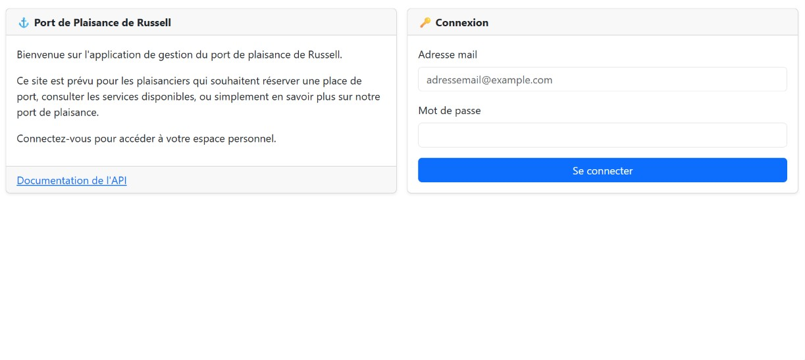
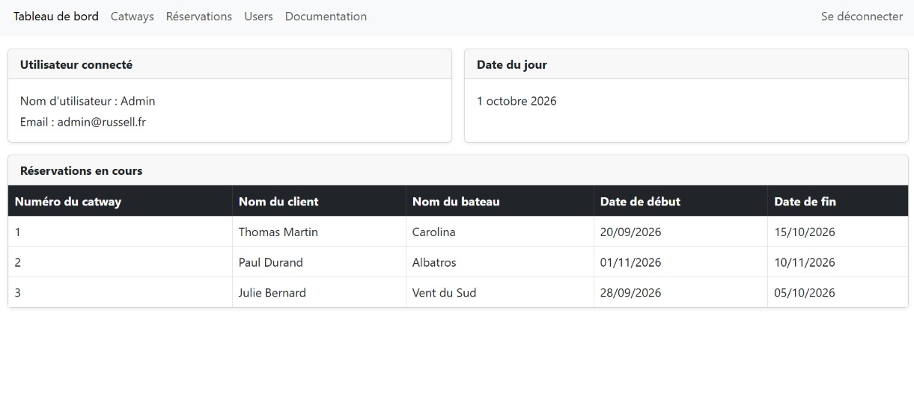
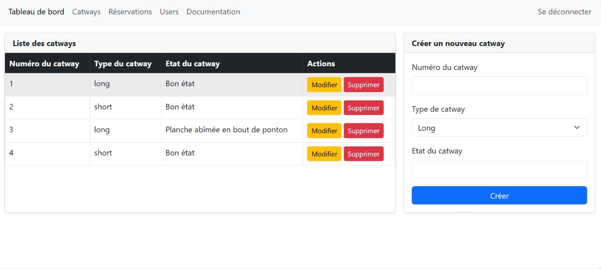

# ⚓ API Russell

A private REST API and management interface for the booking of catways (pontoon berths) at the fictional Russell marina.

> Fictional project built as part of the Web & Mobile Web Developer training (Centre Européen de Formation).

---

## 📖 About the project

The Russell marina wanted a web application to manage its catways and the reservations made by boat owners. The project is made of two parts:

- **A private REST API** (Node.js, Express, MongoDB) exposing full CRUD operations on users, catways and reservations, secured with JWT authentication.
- **A lightweight front-end** (HTML, Bootstrap, vanilla JavaScript) served by the same Express server, allowing the harbour staff to log in and manage the data from a browser.

<p align="center">
  
  
  
</p>


---

## ✨ Features

### API
- Full CRUD on **users**, **catways** and **reservations**
- Reservations nested under their catway (`/catways/:id/reservations`)
- **JWT authentication**: token issued at login and automatically renewed on every authenticated request (24h sliding expiry)
- Passwords hashed with **bcrypt** (Mongoose `pre('save')` hook)
- Data validation at schema level (required fields, allowed catway types, minimum password length, unique email and catway number)

### Management interface
- Login page
- Dashboard: logged-in user, current date and list of ongoing reservations
- Management pages for catways, reservations and users
- Built-in API documentation page

---

## 🛠 Tech stack

| Layer | Technology |
|---|---|
| Back-end | Node.js · Express 5 |
| Database | MongoDB · Mongoose |
| Authentication | JSON Web Token (jsonwebtoken) · bcrypt |
| Front-end | HTML · Bootstrap 5 · vanilla JavaScript (Fetch API) |
| Tooling | nodemon · env-cmd |

---

## 🔐 Data model

| Collection | Fields |
|---|---|
| **User** | `username`, `email` (unique, lowercase), `password` (hashed, min. 6 characters) |
| **Catway** | `catwayNumber` (unique), `catwayType` (`long` or `short`), `catwayState` |
| **Reservation** | `catwayNumber`, `clientName`, `boatName`, `startDate`, `endDate` |

All documents include `createdAt` and `updatedAt` timestamps.

---

## 📡 API reference

Protected routes (🔒) require a valid token, sent in the `Authorization` header as `Bearer <token>` (the `x-access-token` header is also accepted).

### Authentication

| Method | Route | Description | Access |
|---|---|---|---|
| POST | `/login` | Log in with `email` and `password` — the JWT is returned in the `Authorization` response header | Public |
| GET | `/logout` | Log out | Public |

### Users

| Method | Route | Description | Access |
|---|---|---|---|
| GET | `/users` | List all users | 🔒 |
| GET | `/users/:email` | Get a user by email | 🔒 |
| POST | `/users` | Create a user | Public |
| PUT | `/users/:email` | Update a user | 🔒 |
| DELETE | `/users/:email` | Delete a user | 🔒 |

### Catways

| Method | Route | Description | Access |
|---|---|---|---|
| GET | `/catways` | List all catways | 🔒 |
| GET | `/catways/:id` | Get a catway by number | 🔒 |
| POST | `/catways` | Create a catway | Public |
| PUT | `/catways/:id` | Update a catway's state | 🔒 |
| DELETE | `/catways/:id` | Delete a catway | 🔒 |

### Reservations

| Method | Route | Description | Access |
|---|---|---|---|
| GET | `/catways/:id/reservations` | List the reservations of a catway | 🔒 |
| GET | `/catways/:id/reservations/:idReservation` | Get a reservation | 🔒 |
| POST | `/catways/:id/reservations` | Create a reservation | Public |
| PUT | `/catways/:id/reservations/:idReservation` | Update a reservation | 🔒 |
| DELETE | `/catways/:id/reservations/:idReservation` | Delete a reservation | 🔒 |

### Example

```bash
# Log in and read the token from the response headers
curl -i -X POST http://localhost:8000/login \
  -H "Content-Type: application/json" \
  -d '{"email": "admin@example.com", "password": "yourpassword"}'

# Call a protected route with the token
curl http://localhost:8000/catways \
  -H "Authorization: Bearer <token>"
```

---

## 🗂 Project structure

```
api-russell/
├── env/                    # Environment files (not committed)
└── server/
    ├── app.js              # Express app: middlewares, static files, routes
    ├── server.js           # Entry point
    ├── db/                 # MongoDB connection
    ├── models/             # Mongoose schemas (User, Catway, Reservation)
    ├── services/           # Business logic per entity
    ├── routes/             # Express routers
    ├── middlewares/        # JWT verification
    └── public/             # Front-end (HTML pages, CSS, JavaScript)
```

---

## 🚀 Getting started locally

### Prerequisites
- Node.js 18+
- A MongoDB instance (local or MongoDB Atlas)

### 1. Clone and install

```bash
git clone https://github.com/Marine-Briet/api-russell.git
cd api-russell/server
npm install
```

### 2. Environment variables

Environment files live in an `env/` folder at the root of the project (never committed — see `.gitignore`). Create `env/.env.dev`:

```env
URL_MONGO=mongodb://localhost:27017
SECRET_KEY=your_jwt_secret
PORT=8000
```

The database name (`api-russell`) is set in `server/db/mongo.js`.

### 3. Run the server

```bash
cd server
npm run dev
```

The API and the management interface are available at `http://localhost:8000`.

| Script | Environment file |
|---|---|
| `npm run dev` | `env/.env.dev` |
| `npm run prod` | `env/.env.prod` |
| `npm start` | `env/.env` (with the Node inspector enabled) |

### 4. Create a first user

```bash
curl -X POST http://localhost:8000/users \
  -H "Content-Type: application/json" \
  -d '{"username": "Admin", "email": "admin@example.com", "password": "yourpassword"}'
```

You can then log in from the home page.

---

## 🔭 Future improvements

- Protect the creation routes (`POST /users`, `/catways`, `/reservations`) with the JWT middleware
- Exclude password hashes from user responses
- Add automated tests (Mocha / Chai / Supertest)
- Check for overlapping reservations on the same catway
- Deploy the API and the interface online

---

## 👤 Author

Marine BRIET
Built as part of the Web & Mobile Web Developer training — Centre Européen de Formation.
